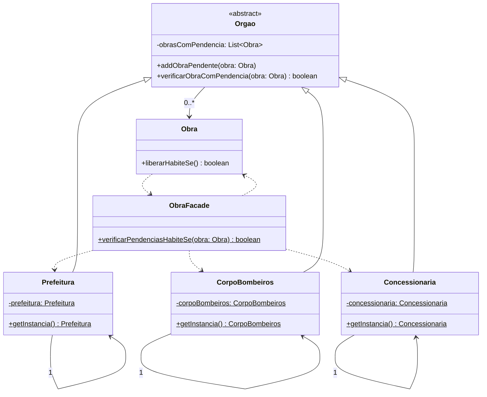

# Diagrama UML — Facade (Habite-se de Obra)

```mermaid
classDiagram
    class Obra {
        +liberarHabiteSe() boolean
    }

    class ObraFacade {
        +verificarPendenciasHabiteSe(obra: Obra)$ boolean
    }

    class Orgao {
        <<abstract>>
        -obrasComPendencia: List~Obra~
        +addObraPendente(obra: Obra)
        +verificarObraComPendencia(obra: Obra) boolean
    }

    class Prefeitura {
        -prefeitura: Prefeitura$
        +getInstancia() Prefeitura$
    }

    class CorpoBombeiros {
        -corpoBombeiros: CorpoBombeiros$
        +getInstancia() CorpoBombeiros$
    }

    class Concessionaria {
        -concessionaria: Concessionaria$
        +getInstancia() Concessionaria$
    }

    Obra ..> ObraFacade
    ObraFacade ..> Obra
    ObraFacade ..> Prefeitura
    ObraFacade ..> CorpoBombeiros
    ObraFacade ..> Concessionaria

    Orgao <|-- Prefeitura
    Orgao <|-- CorpoBombeiros
    Orgao <|-- Concessionaria

    Orgao --> Obra : 0..*

    Prefeitura --> Prefeitura : 1
    CorpoBombeiros --> CorpoBombeiros : 1
    Concessionaria --> Concessionaria : 1
```
